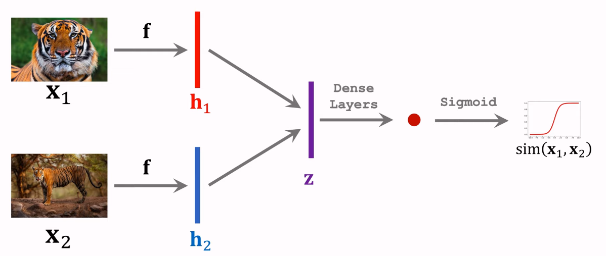

# Get Output from ArXiv Demystified (GOAD)

A. Table of Contents
- [Get Output from ArXiv Demystified (GOAD)](#get-output-from-arxiv-demystified-goad)
  - [A. Rationale For Application](#a-rationale-for-application)
  - [B. Application Deployment \& Folder Structure](#b-application-deployment--folder-structure)
    - [B.1 Application  Deployment](#b1-application--deployment)
    - [B.2  Folder Structure](#b2--folder-structure)
  - [C. Technology stack](#c-technology-stack)
  - [D. Data Pipeline](#d-data-pipeline)
  - [E. Clustering via Network Graphs](#e-clustering-via-network-graphs)
  - [F. Other resources and references](#f-other-resources-and-references)
---
## A. Rationale For Application

Machine Learning is a quickly evolving field, there is a need to constantly scan the academic landscape for research papers for scientific breakthrough's that can give one an edge in model performance.

A popular database for such academic literature is [arXiv](https://arxiv.org/), hosted by Cornell Unversity. It serves as a free distribution service and an open-access archive for scholarly articles across diverse academic fields.

However, one problem with searching thorugh this site, is that materials can cut across different fields and may not be relevant to the user if he was solely using the default browser search engine.

Hence, this project aims to improve the user experience of the website by clustering the search results. This clustered result organization in tandem with provding other relevant information, can better help learners navigate the available academic research. Users can then navigate to the most relevent clusters by clicking on nodes to select the papers they would like to view.

---
## B. Application Deployment & Folder Structure 

### B.1 Application  Deployment

The entire file system was created in a virtual environment using conda.

Python 3.9.15 is required, please follow these steps to replicate the virtual environment: 

```bash
conda create -n arvix-clustering-search python=3.9.15
conda activate arvix-clustering-search
```
Install requirements file using:

```bash
pip install -r requirements.txt
```

Please execute the following in bash to run streamlit on local drive
```bash
streamlit run src/main.py
```

Please execute the following in bash to run deployment of streamlit in local docker environment
```bash
docker build -t goad -f ./docker/Dockerfile .
docker run goad
```

To run deployment in Polyaxon, in addition to the above, please execute the following commands in bash 

```bash
docker push "arvix-clustering-search:0.2.0"
polyaxon run \
  -f docker/streamlit.yml \
  -P DOCKER_IMAGE="arvix-clustering-search:0.2.0" \
  -p aiap-ishinora
```

### B.2  Folder Structure

Folder structure of repository:

```bash
.
├── README.md
├── requirements.txt
├── assets
│   └── siamese_network.png
├── docker
│   ├── Dockerfile
│   ├── entrypoint.sh
│   └── streamlit.yml
└── src
    ├── app_func
    │   ├── datapipeline.py
    │   ├── network_graph.py
    │   ├── sentence_encoder.py
    │   └── visualisation.py
    └── main.py
```

---
## C. Technology stack

Technologies used to build this demo are listed below:

| Technology | Application Area | Application Attributes |
|:---|:---|:---|
| Streamlit  | FrontEnd | Simple front end framework in python that allows for quick iteration and fast prototyping.|
| Sentence-BERT</br> "all-MiniLM-L6-v2" | Generate Embeddings | Distilled Bert model trained by Microsoft. Quickly generates sentence representation/embeddings for calculation of cosine similarity. |
| Plotly | Data Visualization | Able to quickly generate graphs and charts with interactive elements, which increase user interest. |
| Docker | Deployment | Standardizes deployment environment and continuous integration/ delivery pipelines |

---
## D. Data Pipeline

Overall application datapipeline is as follows:

1. Application front end on Streamlit
2. Live-API returns XML data from arXiv which is converted to pandas dataframe
3. Calculate Cosine similarity scores for the result "Summary"
4. Plot network graph based on Cosine Similarity Score
5. Plot other infographics (e.g. papers published and period published )
6. Return plots and information to frontend

Schematic diagram of application datapipeline as below:

---
## E. Clustering via Network Graphs 

Sentence Similarity is the task of determining how similar two pieces of texts are. Sentence similarity models convert input texts into vectors (embeddings) that capture semantic information and calculate how close (similar) they are between them. This task is particularly useful for information retrieval and clustering/grouping.

Sentence-BERT (SBERT)

- State-of-the-art performance on sentence-pair regression tasks like semantic textual similarity (STS).
- Simultaneous feeding in of both sentences causes high computational overhead which makes traditional BERT models unsuitable for semantic similarity search.
- SBERT uses a siamese network, which is a class of neural network architectures that contain two or more identical subnetworks.

- Siamese network uses the same weights while working in tandem on two different input vectors to compute comparable output vectors.
- Reduces time used to find the most similar pair from 65 hours with traditional BERT/RoBERTa to ~5 seconds with SBERT [1].

---

## F. Other resources and references

**Resources**

- [BERT For Measuring Text Similarity](https://towardsdatascience.com/bert-for-measuring-text-similarity-eec91c6bf9e1)

 - [A friendly introduction to Siamese Networks](https://towardsdatascience.com/a-friendly-introduction-to-siamese-networks-85ab17522942)

**References**
1. Reimers, N., & Gurevych, I. (2019). Sentence-bert: Sentence embeddings using siamese bert-networks. arXiv preprint arXiv:1908.10084.
---